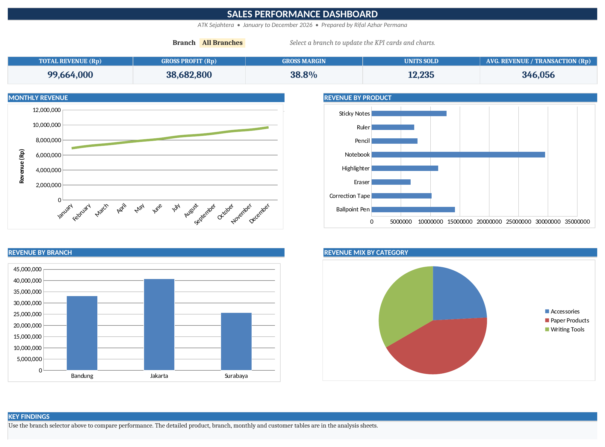

# Sales Performance Analytics Portfolio

Excel-based sales analytics dashboard for a 3-branch retail business (ATK Sejahtera). Built from 288 raw transactions using SUMIFS, INDEX/MATCH, and IFERROR to power a live, filterable dashboard with branch, product, monthly, and customer breakdowns.

## What This Demonstrates

- Cleaned and structured 288 rows of raw transaction data from 3 branches
- Built a fully formula-driven analysis system (no PivotTables) using SUMIFS, INDEX/MATCH, and IFERROR
- Interactive dashboard with a branch filter: KPI cards and charts update automatically
- Data-backed business insights in the Executive Summary sheet

## Workbook Structure

| Sheet | Purpose |
|---|---|
| Dashboard | Main view with branch filter, KPI cards, and charts |
| Raw Data | Transaction-level source data |
| Sales Analysis | Product performance |
| Branch Analysis | Branch and category performance |
| Monthly Analysis | Monthly trend and growth |
| Customer Analysis | Customer and sales rep contribution |
| Summary | Key metrics and findings |
| Calculations | Helper tables for dashboard charts |

## Files

- [`Rifal_Azhar_Permana_Sales_Analytics_Portfolio.xlsx`](./Rifal_Azhar_Permana_Sales_Analytics_Portfolio.xlsx) — Full interactive workbook
- [`Rifal_Azhar_Permana_Sales_Analytics_Portfolio.pdf`](./Rifal_Azhar_Permana_Sales_Analytics_Portfolio.pdf) — Static PDF export

## Tools Used

Excel · SUMIFS · INDEX/MATCH · IFERROR · Data Cleaning · Dashboard Design

## Contact

Rifal Azhar Permana
[LinkedIn](https://www.linkedin.com/in/rifalazharpermana/) · rifalazharpermana@gmail.com
